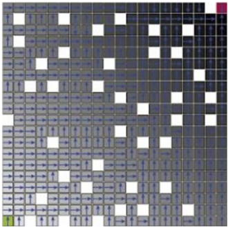

# Gridworld Value Iteration

## Introducción

El problema a resolver es del tipo Gridworld, lo cual significa que contamos con un espacio en forma de cuadrícula MxN, en la que un agente comienza en un cuadrado de la cuadrícula y el objetivo es moverse a otro cuadrado objetivo, que puede estar ubicado en otro lugar. Los problemas Gridworld suelen utilizarse para aplicar algoritmos de Reinforcement Learning para identificar rutas y políticas óptimas para que los agentes en la cuadrícula lleguen a los cuadrados deseados en la menor cantidad de movimientos. 

En este caso, como podemos ver en la Figura 1, la posición origen es representada como un cuadro verde y la posición destino, como un cuadro rojo. Además, la cuadrícula cuenta con cuadros blancos que representan paredes, por donde el agente no puede pasar.



### Procesos de decisión markovianos

El proceso de decisión de Markov (MDP) es un marco matemático empleado en el modelamiento de problemas de toma de decisiones donde los resultados son en parte aleatorios y en parte controlables. Gracias a este marco, podemos abordar gran parte de los problemas de Reinforcement Learning. Existen, además, algunos términos que son necesarios entender para el uso del marco:

- Agente: Un agente es la entidad a la que estamos entrenando para que pueda tomar decisiones.
- Entorno: Es por donde puede interactuar el agente. En nuestro caso, por ejemplo, sería la cuadrícula, considerando además que existen paredes por las que el agente no puede pasar.
- Estado: El estado define la situación actual del agente. Para el enunciado del proyecto 1, el estado definiría la ubicación en la cuadrícula del agente.
- Acción: Es la elección que hace el agente en el tiempo actual. Por ejemplo, podemos movernos hacia arriba, abajo, derecha, izquierda, siempre considerando que existen paredes que no podemos atravesar.
- Política: Es el proceso de pensamiento detrás de elegir una acción. En la práctica, es una distribución de probabilidad asignada al conjunto de acciones. 

### Value iteration

Iteración de valor es un método para encontrar la función de valor óptimo V resolviendo iterativamente la ecuación de Bellman. Utiliza programación dinámica para mantener una función de valor V que se aproxima a la función de valor óptimo
V*, mejorando iterativamente V hasta que converge en V*.


## Desarrollo del algoritmo

Para la ejecución de algoritmo se puede usar la versión determinística o estocástica.

```bash
python deterministic.py
python stochastic.py
```
Para cambiar de archivo, se puede modificar la línea `152` del archivo `deterministic.py`

```python
...
if __name__ == '__main__':

    domain_file = './PruebasGrid/FixedGoalInitialState/navigation_1_grid.net'
...
```

Igualmente, en el archivo `stochastic.py`, modificar la línea `160`
```python
...
if __name__ == '__main__':

    domain_file = './PruebasGrid/FixedGoalInitialState/navigation_2_grid.net'
...
```

También se puede ejecutar desde el siguiente notebook en Google Colab:
https://colab.research.google.com/drive/1g-RBCWC0_z3X35d6xjNOK_DKRNOk0uMq?authuser=1#scrollTo=XBo7Sl0dkwNp